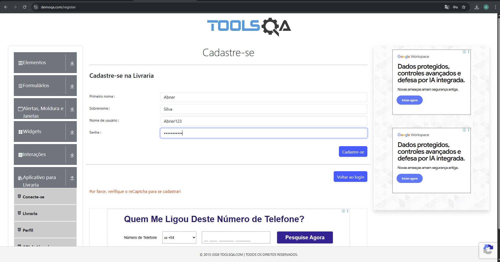
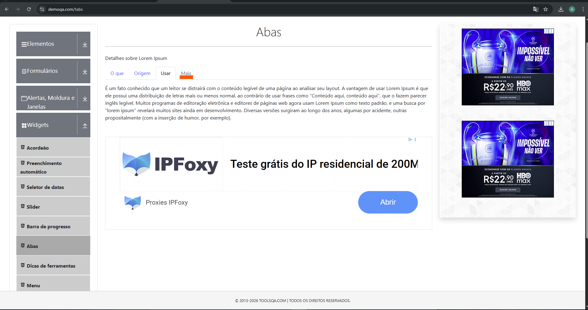
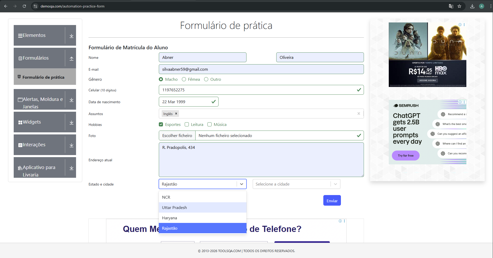
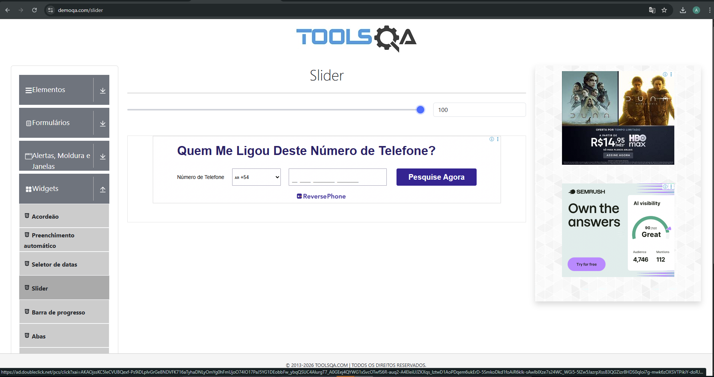
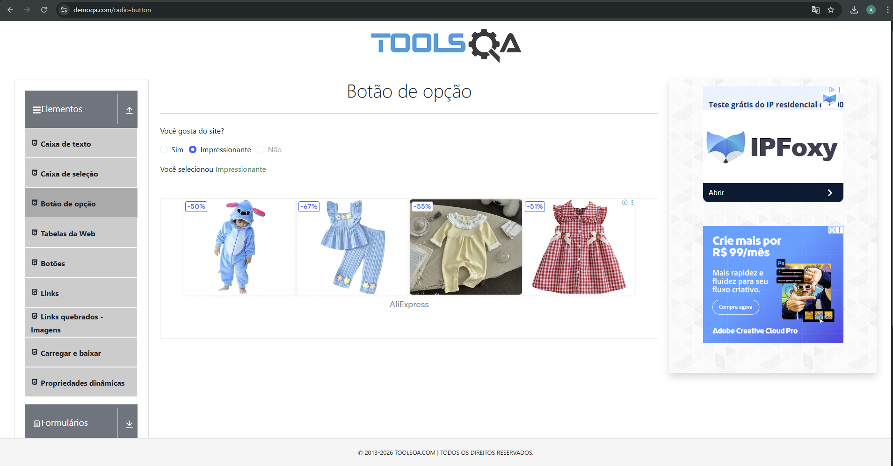

# Defects Report

## 1. Registration fails even with valid data due to reCAPTCHA requirement

### Steps to Reproduce:

1. Navigate to https://demoqa.com/register
2. Fill all required fields with valid data:

   * First Name
   * Last Name
   * Username
   * Password (meeting all requirements)
3. Click on "Register"

### Expected Result:

The user should be successfully registered when all required fields are filled with valid data.

### Actual Result:

An error message is displayed:
**"Please verify reCaptcha to register!"**
The registration is blocked even though all form fields are valid.

### Severity:

High

### Priority:

High

### Impact:

This issue prevents users from completing the registration process, directly impacting usability and blocking access to the system.

### Evidence:

### Notes:

The system enforces reCAPTCHA validation but does not provide proper guidance or fallback, which may cause confusion for users and block valid registrations.
## 2. "More" tab is not selectable or does not respond to user interaction

### Steps to Reproduce:

1. Navigate to https://demoqa.com/tabs
2. Locate the tab section ("What", "Origin", "Use", "More")
3. Click on the "More" tab

### Expected Result:

The "More" tab should be selectable and display its corresponding content when clicked.

### Actual Result:

The "More" tab cannot be selected or does not respond to user interaction. No content is displayed.

### Severity:

Medium

### Priority:

Medium

### Impact:

This issue affects user navigation and prevents access to additional content, reducing usability and completeness of the feature.

### Evidence:

Screenshot file: **tabs-more-not-clickable.png**

### Notes:

The tab appears to be disabled in the DOM (aria-disabled="true"), which may indicate incomplete implementation.
## 3. State and City dropdowns have limited and inconsistent options

### Steps to Reproduce:

1. Navigate to https://demoqa.com/automation-practice-form
2. Scroll to the "State and City" section
3. Click on the "State" dropdown
4. Observe available options
5. Select a state and then click on the "City" dropdown

### Expected Result:

The dropdowns should provide a comprehensive and consistent list of states and corresponding cities, allowing realistic user selection.

### Actual Result:

The "State" dropdown contains only a few limited options (for example: NCR, Uttar Pradesh, Haryana, Rajasthan).
The "City" dropdown is also restricted and depends on these limited selections.

### Severity:

Low

### Priority:

Medium

### Impact:

This limits the usability and realism of the form, making it unsuitable for broader user scenarios and reducing test coverage for location-based inputs.

### Evidence:

Screenshot file: **state-city-limited-options.png**

### Notes:

The dataset appears to be static and incomplete, which may indicate a demo limitation or lack of scalability in the form design.
## 4. Slider value change does not trigger any functional behavior

### Steps to Reproduce:

1. Navigate to https://demoqa.com/slider
2. Move the slider to different positions (e.g., from 0 to 100)
3. Observe the behavior of the application

### Expected Result:

Changing the slider value should trigger a visible or functional change in the application (e.g., updating related data, triggering an action, or affecting UI behavior).

### Actual Result:

The slider value changes numerically, but no functional or visual impact is observed in the application.

### Severity:

Low

### Priority:

Low

### Impact:

This may confuse users, as the component appears interactive but does not provide meaningful functionality, reducing overall usability.

### Evidence:

Screenshot file: **slider-no-functional-impact.png**

### Notes:

The slider appears to be implemented only for demonstration purposes and lacks integration with any functional behavior.
## 6. "No" radio button is not selectable

### Steps to Reproduce:

1. Navigate to https://demoqa.com/radio-button
2. Locate the question "Do you like the site?"
3. Attempt to select the "No" radio button

### Expected Result:

The user should be able to select all available radio options ("Yes", "Impressive", and "No").

### Actual Result:

The "No" radio button cannot be selected. It appears disabled or unresponsive to user interaction.

### Severity:

Medium

### Priority:

Medium

### Impact:

This restricts user input and prevents full interaction with the form, limiting test coverage and reducing usability.

### Evidence:

Screenshot file: **radio-button-not-selectable.png**

### Notes:

The radio button appears to be intentionally disabled (possibly for demonstration), but this behavior is not clearly communicated to the user.

