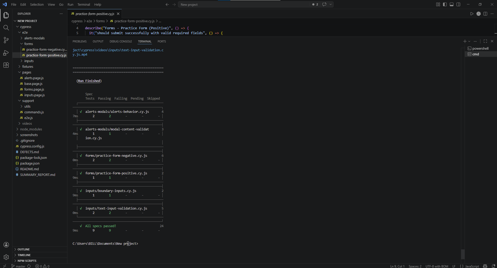

# Cypress Web QA Challenge

## Overview
This repository contains a web test automation challenge built with Cypress for the DemoQA website.

Application under test: https://demoqa.com/

Covered areas:
- Forms
- Inputs
- Alerts and Modals

## Important Submission Rule
All final implementation code must be authored by the developer.
This project structure and documentation are guidance-oriented; final code ownership must remain with the developer.

## Tech Stack
- Cypress (latest)
- JavaScript (TypeScript-ready structure)
- Node.js + npm

## Project Structure
```text
cypress/
  e2e/
    forms/
    inputs/
    alerts-modals/
  pages/
  fixtures/
  support/
    utils/
```

Folder responsibilities:
- `cypress/e2e`: test specs grouped by feature area
- `cypress/pages`: Page Object Model classes and UI interaction abstractions
- `cypress/fixtures`: static test data for positive/negative scenarios
- `cypress/support`: custom commands, global hooks, and helper utilities

## Prerequisites
- Node.js LTS
- npm
- Chrome or Electron (used by Cypress)

## Installation
1. Install dependencies:
```bash
npm install
```
2. Validate Cypress installation:
```bash
npx cypress --version
```

## Run Tests
Headless mode:
```bash
npm run test:headless
```

Headed mode (interactive runner):
```bash
npm run test:headed
```

Default command:
```bash
npm test
```

## Test Design Principles
- Use Page Object Model to separate test intent from page details
- Use stable selectors and avoid brittle CSS paths
- Keep specs DRY with reusable functions/commands
- Avoid fixed waits (`cy.wait(time)`)
- Prioritize high-value user flows and meaningful edge cases

## Reporting and Evidence
Execution outputs can be reviewed via:
- terminal summary per spec
- `cypress/screenshots`
- `cypress/videos`

### Sample Execution Result


## Documentation Included
- `README.md`: setup and execution guide
- `SUMMARY_REPORT.md`: approach, design decisions, trade-offs, and observations
- `DEFECTS.md`: reproducible defects with impact and evidence

## Future Improvements
1. Add CI pipeline (GitHub Actions) with test artifact upload
2. Add tags for smoke/regression execution subsets
3. Add quality metrics tracking (pass rate and flaky trend)
4. Expand fixture matrix for boundary and negative combinations
